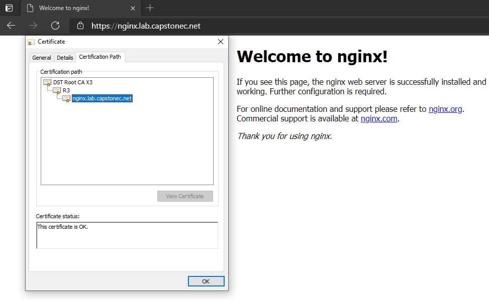
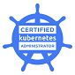
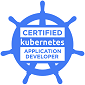

# DNS and CA Integrations for Kubernetes

One of the challenges with demonstrating what you have done in Kubernetes is directing others to your application in a secure manner. This typically involves you having to create a DNS entry and requesting a certificate. Two projects, [ExternalDNS](https://github.com/kubernetes-sigs/external-dns) and [cert-manager](https://cert-manager.io/), respectively, are making it much easier to automate this process and hide the complexities from developers. Both projects are under active development (with commits in the last few hours or days) and a lot of interest (thousands of stars on GitHub).

In the post that follows we'll create a Kubernetes cluster, add an ingress controller, and deploy our application. Then we'll deploy ExternalDNS and cert-manager in our cluster. Finally, we'll show how they can be used to give end users secure access to our application.

## Create a Kubernetes Cluster

To create our Kubernetes cluster, we will use VMware's [Tanzu Kubernetes Grid](https://tanzu.vmware.com/kubernetes-grid) or TKG. TKG uses [Cluster-API](https://github.com/kubernetes-sigs/cluster-api) to manage the lifecycle of Kubernetes clusters. In our case, we have a management cluster already running in AWS. We'll use it to create our workload cluster. The default dev plan creates a cluster with one control plan node and one worker node (as well as a bastion host for accessing them, if necessary). We'll modify this plan to have it create two worker nodes instead of one. We then retrieve the credentials for administering the cluster and see what has been built.

```bash
$ tkg create cluster demo-cluster --plan=dev --worker-machine-count 2
$ tkg get clusters
 NAME                 NAMESPACE  STATUS   CONTROLPLANE  WORKERS  KUBERNETES        ROLES
 demo-cluster         default    running  1/1           2/2      v1.19.3+vmware.1  <none>
$ tkg get credentials demo-cluster
Credentials of workload cluster 'demo-cluster' have been saved
You can now access the cluster by running 'kubectl config use-context demo-cluster-admin@demo-cluster'
$ kubectl config use-context demo-cluster-admin@demo-cluster
Switched to context "demo-cluster-admin@demo-cluster".
$ kubectl get nodes
NAME                                       STATUS   ROLES    AGE    VERSION
ip-10-0-1-235.us-west-2.compute.internal   Ready    <none>   119m   v1.19.3+vmware.1
ip-10-0-1-239.us-west-2.compute.internal   Ready    <none>   126m   v1.19.3+vmware.1
ip-10-0-1-96.us-west-2.compute.internal    Ready    master   128m   v1.19.3+vmware.1
```

## Install an Ingress Controller

To give end users access to applications running in our Kubernetes cluster, we need to install an ingress controller. For this example, we are going to use the [Contour](https://github.com/projectcontour/contour) ingress controller. There are three options for installing Contour, a deployment manifest, an operator, or a Helm chart. We'll use the Helm chart in this case but you may want to explore the other options. The operator is in alpha but bears watching as operators in general make lifecycle management of cluster add-ins easier.

```bash
$ helm repo add bitnami https://charts.bitnami.com/bitnami
"bitnami" has been added to your repositories
$ helm install contour bitnami/contour
NAME: contour
LAST DEPLOYED: Thu Apr 22 18:33:22 2021
NAMESPACE: default
STATUS: deployed
REVISION: 1
TEST SUITE: None
NOTES:
1. Get Contours's load balancer IP/hostname:

     NOTE: It may take a few minutes for this to become available.

     You can watch the status by running:

         $ kubectl get svc contour-envoy --namespace default -w

     Once 'EXTERNAL-IP' is no longer '<pending>':

         $ kubectl describe svc contour-envoy --namespace default | grep Ingress | awk '{print $3}'

2. Configure DNS records corresponding to Kubernetes ingress resources to point to the load balancer IP/hostname found in step 1
```


## Install an application

For this demonstration we're going to install a generic NGINX website. For this we'll create simple `Deployment` and `Service` manifests and apply them.

```yaml nginx-deployment.yaml
apiVersion: apps/v1
kind: Deployment
metadata:
  name: nginx
spec:
  selector:
    matchLabels:
      app: nginx
  template:
    metadata:
      labels:
        app: nginx
    spec:
      containers:
      - image: nginx
        name: nginx
        ports:
        - containerPort: 80
```
```yaml nginx-service.yaml
apiVersion: v1
kind: Service
metadata:
  name: nginx-svc
spec:
  ports:
  - port: 80
    protocol: TCP
    targetPort: 80
  selector:
    app: nginx
  type: ClusterIP
```

```bash
$ kubectl apply -f nginx-deployment.yaml 
deployment.apps/nginx created
$ kubectl apply -f nginx-service.yaml 
service/nginx-svc created
```

We now have our demo application running in our new Kubernetes cluster but there is no way for an end user to access it.

## Install ExternalDNS

The [ExternalDNS](https://github.com/kubernetes-sigs/external-dns) project configures DNS servers with addresses for services exposed by a Kubernetes cluster. ExternalDNS supports a large variety of DNS servers from cloud providers like AWS, Azure, and Google to more domain centric providers like Infoblox, GoDaddy, and DNSimple. Check the GitHub repository for a complete list. In our case, we use Azure DNS to manage our lab.capstonec.net subdomain.

In order to use ExternalDNS, we need to create a JSON file with the details of an Azure service principal with contributor permissions for the resource group (capstonec.net in this case) which contains the (lab.capstonec.net) DNS Zone resource.

```json azure.json
{
  "tenantId": "12345678-9012-3456-7890-123456789012",
  "subscriptionId": "abcdefgh-ijkl-mnop-qrst-uvwxyzabcdef",
  "resourceGroup": "capstonec.net",
  "aadClientId": "01234abc-de56-ff78-abc1-234567890def",
  "aadClientSecret": "0VZBkxeCSOtDHGgEMftg"
}
```

And, create a Kubernetes secret, `azure-config-file`, from this JSON file in the external-dns namespace.

```bash
$ kubectl create namespace external-dns
namespace/external-dns created
$ kubectl -n external-dns create secret generic azure-config-file --from-file=azure.json
secret/azure-config-file created
```

Next, we create a deployment manifest for external-dns which includes the details of DNS domain being managed and the service principal secret we created above. The manifest also includes the `ClusterRole` and `ClusterRoleBinding` which allows ExternalDNS to list changes to ingresses, services, etc.

```yaml external-dns.yaml
apiVersion: v1
kind: ServiceAccount
metadata:
  name: external-dns
---
apiVersion: rbac.authorization.k8s.io/v1beta1
kind: ClusterRole
metadata:
  name: external-dns
rules:
- apiGroups: [""]
  resources: ["services","endpoints","pods"]
  verbs: ["get","watch","list"]
- apiGroups: ["extensions","networking.k8s.io"]
  resources: ["ingresses"] 
  verbs: ["get","watch","list"]
- apiGroups: [""]
  resources: ["nodes"]
  verbs: ["list"]
---
apiVersion: rbac.authorization.k8s.io/v1beta1
kind: ClusterRoleBinding
metadata:
  name: external-dns-viewer
roleRef:
  apiGroup: rbac.authorization.k8s.io
  kind: ClusterRole
  name: external-dns
subjects:
- kind: ServiceAccount
  name: external-dns
  namespace: default
---
apiVersion: apps/v1
kind: Deployment
metadata:
  name: external-dns
spec:
  strategy:
    type: Recreate
  selector:
    matchLabels:
      app: external-dns
  template:
    metadata:
      labels:
        app: external-dns
    spec:
      serviceAccountName: external-dns
      containers:
      - name: external-dns
        image: k8s.gcr.io/external-dns/external-dns:v0.7.6
        args:
        - --source=service
        - --source=ingress
        - --domain-filter=lab.capstonec.net
        - --provider=azure
        volumeMounts:
        - name: azure-config-file
          mountPath: /etc/kubernetes
          readOnly: true
      volumes:
      - name: azure-config-file
        secret:
          secretName: azure-config-file
```

Deploy external-dns.

```bash
$ kubectl -n external-dns apply -f external-dns.yaml 
serviceaccount/external-dns created
Warning: rbac.authorization.k8s.io/v1beta1 ClusterRole is deprecated in v1.17+, unavailable in v1.22+; use rbac.authorization.k8s.io/v1 ClusterRole
clusterrole.rbac.authorization.k8s.io/external-dns created
Warning: rbac.authorization.k8s.io/v1beta1 ClusterRoleBinding is deprecated in v1.17+, unavailable in v1.22+; use rbac.authorization.k8s.io/v1 ClusterRoleBinding
clusterrolebinding.rbac.authorization.k8s.io/external-dns-viewer created
deployment.apps/external-dns created
```

At this point, ExternalDNS is now listening for ingresses and services of type `LoadBalancer` and will create DNS CNAME entries which correspond to them.

## Install cert-manager
The [cert-manager](https://cert-manager.io/) project makes the process of requesting and renewing certificates easy for resources within a Kubernetes cluster.

```bash
$ helm repo add jetstack https://charts.jetstack.io
"jetstack" has been added to your repositories
$ helm repo update
Hang tight while we grab the latest from your chart repositories...
...Successfully got an update from the "jetstack" chart repository
...Successfully got an update from the "bitnami" chart repository
Update Complete. ⎈Happy Helming!⎈
$ kubectl apply -f https://github.com/jetstack/cert-manager/releases/download/v1.2.0/cert-manager.crds.yaml
customresourcedefinition.apiextensions.k8s.io/certificaterequests.cert-manager.io created
customresourcedefinition.apiextensions.k8s.io/certificates.cert-manager.io created
customresourcedefinition.apiextensions.k8s.io/challenges.acme.cert-manager.io created
customresourcedefinition.apiextensions.k8s.io/clusterissuers.cert-manager.io created
customresourcedefinition.apiextensions.k8s.io/issuers.cert-manager.io created
customresourcedefinition.apiextensions.k8s.io/orders.acme.cert-manager.io created
$ kubectl create namespace cert-manager
namespace/cert-manager created
$ helm install cert-manager jetstack/cert-manager --namespace cert-manager
NAME: cert-manager
LAST DEPLOYED: Thu Apr 22 18:47:37 2021
NAMESPACE: cert-manager
STATUS: deployed
REVISION: 1
TEST SUITE: None
NOTES:
cert-manager has been deployed successfully!

In order to begin issuing certificates, you will need to set up a ClusterIssuer
or Issuer resource (for example, by creating a 'letsencrypt-staging' issuer).

More information on the different types of issuers and how to configure them
can be found in our documentation:

https://cert-manager.io/docs/configuration/

For information on how to configure cert-manager to automatically provision
Certificates for Ingress resources, take a look at the `ingress-shim`
documentation:

https://cert-manager.io/docs/usage/ingress/
```

```yaml azuredns-cluster-issuer.yaml
apiVersion: cert-manager.io/v1
kind: ClusterIssuer
metadata:
  name: azuredns-cluster-issuer
spec:
  acme:
    email: ken.rider@capstonec.com
    server: https://acme-v02.api.letsencrypt.org/directory
    privateKeySecretRef:
      name: azuredns-clusterissuer-account-key
    solvers:
    - dns01:
        azureDNS:
          clientID: 01234abc-de56-ff78-abc1-234567890def
          clientSecretSecretRef:
            name: azuredns-config
            key: client-secret
          subscriptionID: abcdefgh-ijkl-mnop-qrst-uvwxyzabcdef
          tenantID: 12345678-9012-3456-7890-123456789012
          resourceGroupName: capstonec.net
          hostedZoneName: lab.capstonec.net
          environment: AzurePublicCloud
```

```bash
$ AZURE_CERT_MANAGER_SP_PASSWORD="0VZBkxeCSOtDHGgEMftg"
$ kubectl -n cert-manager create secret generic azuredns-config --from-literal=client-secret=$AZURE_CERT_MANAGER_SP_PASSWORD
secret/azuredns-config created
$ kubectl -n cert-manager apply -f azuredns-clusterissuer.yaml
clusterissuer.cert-manager.io/azuredns-cluster-issuer created
```

## Create Ingress
In order for an end user to access the `nginx-svc` service running in our cluster, we need to tell the ingress controller what HTTP traffic to route to it and how to terminate HTTPS traffic and route it as HTTP. We do this by specifying an `Ingress` resource.

```yaml nginx-ingress.yaml
apiVersion: networking.k8s.io/v1beta1
kind: Ingress
metadata:
  name: nginx
  annotations:
    cert-manager.io/cluster-issuer: azuredns-cluster-issuer
spec:
  rules:
  - host: nginx.lab.capstonec.net
    http:
      paths:
      - backend:
          serviceName: nginx-svc
          servicePort: 80
        path: /
  tls:
  - hosts:
    - nginx.lab.capstonec.net
    secretName: nginx-ingress-certificate
```

The ingress specifies that any HTTP or HTTPS traffic with a host header matching `nginx.lab.capstonec.net` be routed to the `nginx-svc` service. However, we don't have a DNS entry for `nginx.lab.capstonec.net` at this point nor do we have a certificate for it for HTTPS termination.

This is where ExternalDNS and cert-manager come in. They are watching all `Ingress` resources. If there is a `host` key in the `rules` `spec` that matches the DNS domain we specified in the ExternalDNS configuration, it attempts to create a DNS CNAME record for it with a value that matches the IP address or DNS name of the ingress controller. Similarly, if there is a `hosts` key in the `tls` `spec` that matches the DNS zone specified in the cert-manager `ClusterIssuer` resource, it will generate a signed certificate for it and store it in the specified Kubernetes `Secret` for use by the ingress controller.

```bash
$ kubectl apply -f nginx-ingress.yaml 
Warning: networking.k8s.io/v1beta1 Ingress is deprecated in v1.19+, unavailable in v1.22+; use networking.k8s.io/v1 Ingress
ingress.networking.k8s.io/nginx created
```


## View NGINX Website
Let's open our website, https://nginx.lab.capstonec.net, in our browser. Our browser uses DNS to resolve our host name, nginx.lab.capstonec.net. If we query DNS, we can see that Azure DNS has created a CNAME entry for our host name which points to the AWS load balancer which fronts our Contour ingress controller. Since we specified HTTPS in the URL, our browser needs to fetch the certificate for our site, verify the name it specifies corresponds to the host name we used, and validate it is signed by a certificate authority (CA) we trust. As you can see, our site has a certificate for our host name and it is signed by the Let's Encrypt CA.



## Summary

If you want or need help with your Kubernetes journey, Capstone IT is a VMware Modern Applications Partner as well as being an Azure Gold and AWS Select partner. If you are interested in finding out more and getting help with your Container, Cloud, and DevOps transformation, please [Contact Us](https://capstonec.com/contact-us/).

[Ken Rider](https://www.linkedin.com/in/kenrider) [@KenRider](https://twitter.com/KenRider)  
Solutions Architect  
Capstone IT  



